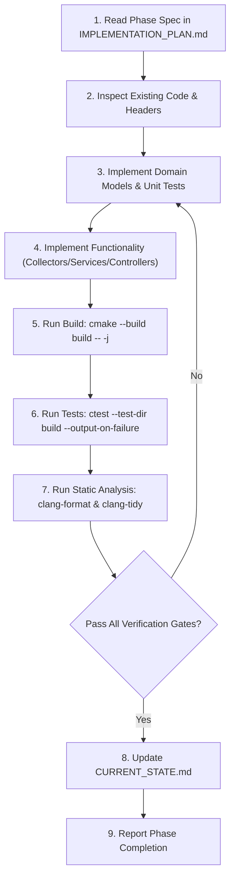

# Autonomous Agent Execution Policy — NodePulse

This document defines the strict, binding operational rules for all AI coding agents and human contributors working within the `nodepulse` repository. Compliance with these directives is mandatory.

---

## 1. Prime Directives

1. **Read Documentation Before Implementation**:
   Before modifying or authoring any code, you MUST thoroughly read the relevant documentation in `docs/` and root specifications. Never guess architectural patterns, conventions, or endpoint contracts.

2. **Inspect Existing Code Before Editing**:
   Examine existing headers, implementations, tests, and CMake configuration prior to introducing changes. Maintain consistency with naming styles, header inclusion order, namespace hygiene, and error-handling paradigms.

3. **Strict Phase Adherence — Only Implement the Currently Approved Phase**:
   Implementation work must proceed strictly according to [IMPLEMENTATION_PLAN.md](file:///home/devqii/workspace/nodepulse/IMPLEMENTATION_PLAN.md) and the `Next approved phase` stated in [CURRENT_STATE.md](file:///home/devqii/workspace/nodepulse/CURRENT_STATE.md).
   - **Do NOT skip ahead** to future phases.
   - **Do NOT begin Phase 1** while Phase 0 (documentation) is active.
   - Any commit, diff, or tool call implementing code outside the current approved phase is a violation of project policy.

4. **Do Not Silently Change Architecture**:
   The architectural layers defined in [ARCHITECTURE.md](file:///home/devqii/workspace/nodepulse/docs/architecture/ARCHITECTURE.md) and ADRs in [docs/adr/](file:///home/devqii/workspace/nodepulse/docs/adr/) are binding:
   - Controllers must never read `/proc`, `/sys`, or execute OS commands directly.
   - Collectors must never depend on HTTP concepts, Drogon headers, or JSON serializations.
   - Services must coordinate collectors and domain structures.
   - Domain structs must be used across boundaries instead of passing raw JSON blobs through lower layers.
   Any proposed architectural deviation requires an explicit Architectural Decision Record (ADR) update and human approval before code changes.

5. **Zero Unjustified Dependencies**:
   Do not introduce third-party libraries, submodules, or system packages without formal justification and prior approval recorded in [DECISIONS.md](file:///home/devqii/workspace/nodepulse/DECISIONS.md). Approved core libraries are: Drogon, spdlog, nlohmann/json, GoogleTest, libcurl, and later libpqxx / Prometheus C++ client.

6. **Test-Driven Discipline (Add Tests with Functionality)**:
   Every newly introduced function, collector parser, domain structure, or API endpoint must be accompanied by comprehensive unit or integration tests:
   - `/proc` parsers must have fixture-driven unit tests utilizing simulated `/proc` strings.
   - Controllers and middlewares must have integration tests validating request/response behaviors and error cases.

7. **Verify Before Reporting Completion**:
   Never mark a phase, task, or prompt as complete without executing the phase's designated verification commands (compilation under `-Wall -Wextra -Wpedantic -Werror`, test execution, sanitizers if applicable). Always verify that zero compiler warnings or test failures exist.

8. **Synchronize Project State in CURRENT_STATE.md**:
   Whenever a phase's exit gate is successfully verified, update [CURRENT_STATE.md](file:///home/devqii/workspace/nodepulse/CURRENT_STATE.md) to record the transition, current status, artifact inventory, and unlock the next phase.

---

## 2. Prohibited Behaviors & Hard Safety Constraints

Agents are strictly forbidden from performing any of the following actions:

- ❌ **Do not disable tests to get green CI**: Never comment out, ignore (`GTEST_SKIP` without justification), or delete failing tests. A failing test denotes a defect in implementation, not an obstacle to be bypassed.
- ❌ **Do not weaken compiler warnings or flags**: `-Wall -Wextra -Wpedantic -Werror` are mandatory. Never suppress warnings via `#pragma GCC diagnostic ignored` or CMake flag removals unless approved by an ADR for third-party headers.
- ❌ **Do not commit secrets or hardcoded credentials**: Never commit API keys, database passwords, private keys, or tokens. Use configuration files (`config/*.json`) and environment variables (`NODEPULSE_API_KEY`), ensuring sample configs contain only redactions (`REDACTED_API_KEY`).
- ❌ **Do not introduce privileged Docker execution**:
  - The agent service and test containers must NEVER run with `--privileged`.
  - Access to `/var/run/docker.sock` must be treated as root-equivalent host capability and explicitly documented as a high-security risk.
  - Do not falsely state or assume that Docker socket access is harmless simply because the HTTP API provides read-only inspection.
- ❌ **Do not mix HTTP handling with system collection**: Controllers must only deserialize requests, invoke services, and serialize domain objects into HTTP responses.
- ❌ **Do not perform blocking I/O on Drogon's event loop**: Drogon's reactive thread pool must remain non-blocking. Offload long-running operations or synchronous file reads to worker threads or thread pools when appropriate.

---

## 3. Standard Agent Workflow Per Phase

For every implementation phase:

1. **Discover**: Read the target phase section in [IMPLEMENTATION_PLAN.md](file:///home/devqii/workspace/nodepulse/IMPLEMENTATION_PLAN.md), the relevant requirements in [REQUIREMENTS.md](file:///home/devqii/workspace/nodepulse/docs/product/REQUIREMENTS.md), and associated ADRs.
2. **Design**: Verify header contracts in `include/nodepulse/` and domain models in `include/nodepulse/domain/`.
3. **Test First**: Write fixture-driven tests in `tests/unit/` using mock inputs.
4. **Implement**:author the minimal, clean C++20 code satisfying the phase scope in `src/`.
5. **Compile & Lint**: Execute CMake build with all warnings enabled and run `clang-tidy`.
6. **Execute Tests**: Run `ctest` and verify 100% test pass rate.
7. **Document & State**: Update [CURRENT_STATE.md](file:///home/devqii/workspace/nodepulse/CURRENT_STATE.md).

