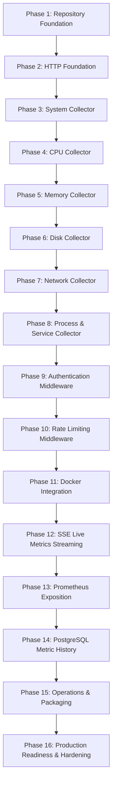

# NodePulse — 16-Phase Implementation Plan

This document defines the authoritative, sequential 16-phase implementation plan for the NodePulse project. Agents and engineers must implement each phase strictly in sequence. No code may be written for a subsequent phase until the current phase's exit gate has been fully met and verified.

---

## Roadmap Overview



---

## Phase 1: Repository Foundation

- **Objective**: Establish the modern C++20 build environment, directory structure, compiler warning configuration, code formatting, static analysis rules, and unit test harness.
- **Allowed Scope**:
  - Author root `CMakeLists.txt` and module `CMakeLists.txt` files.
  - Setup compiler flags (`-std=c++20`, `-Wall -Wextra -Wpedantic -Werror`).
  - Integrate GoogleTest via `FetchContent` or system package.
  - Configure `.clang-format` and `.clang-tidy`.
  - Add basic utility libraries (logging initialization with `spdlog`).
  - Implement a trivial smoke test verifying GoogleTest executes properly.
- **Deliverables**:
  - `CMakeLists.txt` at root and subdirectories.
  - `.clang-format` and `.clang-tidy` configuration files.
  - Basic `include/nodepulse/utils/logger.hpp` and `src/utils/logger.cpp`.
  - Smoke test in `tests/unit/smoke_test.cpp`.
  - GitHub Actions CI workflow file `.github/workflows/ci.yml`.
- **Tests**:
  - Unit test `smoke_test.cpp` verifying `EXPECT_TRUE(true)` and spdlog logger initialization.
- **Verification Commands**:
  ```bash
  cmake -B build -S . -DCMAKE_BUILD_TYPE=Debug
  cmake --build build -- -j$(nproc)
  ctest --test-dir build --output-on-failure
  clang-format --dry-run --Werror src/utils/logger.cpp include/nodepulse/utils/logger.hpp
  ```
- **Exit Gate**:
  - Build succeeds on GCC 11+ and Clang 14+ with `-Werror` and zero warnings.
  - CTest runs and passes 100% of tests.
  - Clang-format and clang-tidy pass cleanly without errors.
- **Explicitly Deferred Work**:
  - Drogon server setup (deferred to Phase 2).
  - Any metric collection or Linux `/proc` parsing (deferred to Phase 3+).

---

## Phase 2: HTTP Foundation

- **Objective**: Integrate the Drogon framework, initialize the server lifecycle, establish JSON error serialization, and implement the `/api/v1/health` endpoint.
- **Allowed Scope**:
  - Link Drogon, Trantor, and `nlohmann/json`.
  - Create `apps/server/main.cpp` providing application entry point.
  - Implement standard JSON error response builder (`docs/api/ERRORS.md`).
  - Implement `HealthController` for `GET /api/v1/health`.
  - Implement graceful shutdown handler on `SIGINT` and `SIGTERM`.
- **Deliverables**:
  - `apps/server/main.cpp`
  - `include/nodepulse/controllers/health_controller.hpp` and `src/controllers/health_controller.cpp`
  - `include/nodepulse/utils/error_response.hpp` and `src/utils/error_response.cpp`
  - `config/config.example.json`
- **Tests**:
  - Integration test for `GET /api/v1/health` returning HTTP 200 with status `"healthy"`.
  - Unit test for standard error envelope JSON generation.
- **Verification Commands**:
  ```bash
  cmake --build build --target nodepulse_server tests_unit tests_integration
  ctest --test-dir build --output-on-failure
  curl -s http://127.0.0.1:8080/api/v1/health | grep '"status":"healthy"'
  ```
- **Exit Gate**:
  - Server starts, binds to port 8080, and responds to `/api/v1/health`.
  - Clean shutdown upon receiving SIGTERM without memory leaks or hangs.
  - 100% test pass rate in CI.
- **Explicitly Deferred Work**:
  - System metrics or `/proc` collection.
  - Authentication middleware (deferred to Phase 9).

---

## Phase 3: System Collector

- **Objective**: Implement host metadata collection from `/etc/os-release`, `/proc/uptime`, `uname()`, and `gethostname()`, exposed via `GET /api/v1/system`.
- **Allowed Scope**:
  - Domain struct `SystemInfo` in `include/nodepulse/domain/system_info.hpp`.
  - Pure collector `SystemCollector` in `src/collectors/system_collector.cpp` reading OS release, uptime, hostname, kernel version, and architecture.
  - `SystemService` coordinating the collector.
  - `SystemController` handling `GET /api/v1/system`.
- **Deliverables**:
  - Domain model, collector interface/implementation, service, and controller.
  - Fixtures for `/proc/uptime` and `/etc/os-release` in `tests/fixtures/proc/`.
- **Tests**:
  - Fixture-driven unit tests parsing simulated `os-release` and `uptime`.
  - Integration test for `GET /api/v1/system` returning expected schema.
- **Verification Commands**:
  ```bash
  cmake --build build
  ctest --test-dir build -R "system_collector_test" --output-on-failure
  curl -s http://127.0.0.1:8080/api/v1/system | jq .
  ```
- **Exit Gate**:
  - Accurate extraction of hostname, OS name/version, kernel version, and uptime seconds.
  - No direct filesystem access from `SystemController`.
  - All fixture tests pass.
- **Explicitly Deferred Work**:
  - CPU, memory, disk, network metric collection.

---

## Phase 4: CPU Collector

- **Objective**: Implement CPU telemetry collection from `/proc/stat`, `/proc/cpuinfo`, and `/proc/loadavg`, exposed via `GET /api/v1/cpu`.
- **Allowed Scope**:
  - Domain models: `CpuMetrics`, `CpuCoreMetrics`, `LoadAverage`.
  - `CpuCollector` parsing cumulative jiffies (user, nice, system, idle, iowait, irq, softirq, steal) and computing differential usage percentage over time intervals.
  - `CpuService` managing polling intervals and delta computations.
  - `CpuController` handling `GET /api/v1/cpu`.
- **Deliverables**:
  - `include/nodepulse/domain/cpu_info.hpp`
  - `include/nodepulse/collectors/cpu_collector.hpp` and `src/collectors/cpu_collector.cpp`
  - `src/services/cpu_service.cpp` and `src/controllers/cpu_controller.cpp`
  - Unit test fixtures in `tests/fixtures/proc/stat` and `loadavg`.
- **Tests**:
  - Unit tests verifying delta jiffies calculation: $0\%$, $50\%$, and $100\%$ CPU scenarios.
  - Load average parser tests (`1min`, `5min`, `15min`).
  - Integration test for `GET /api/v1/cpu`.
- **Verification Commands**:
  ```bash
  cmake --build build
  ctest --test-dir build -R "cpu" --output-on-failure
  curl -s http://127.0.0.1:8080/api/v1/cpu | jq .
  ```
- **Exit Gate**:
  - Accurate aggregate and per-core CPU utilization percentage computation.
  - Resilient handling of counter wraps and missing cores.
- **Explicitly Deferred Work**:
  - Memory or disk collection.

---

## Phase 5: Memory Collector

- **Objective**: Implement memory and swap usage telemetry from `/proc/meminfo`, exposed via `GET /api/v1/memory`.
- **Allowed Scope**:
  - Domain model `MemoryMetrics` (total, free, available, buffers, cached, active, inactive, swap total, swap free, swap used).
  - `MemoryCollector` parsing `/proc/meminfo` in kibibytes and converting to bytes.
  - Calculation of `used_bytes` ($total - available$) and percentages.
  - `MemoryService` and `MemoryController` handling `GET /api/v1/memory`.
- **Deliverables**:
  - Domain struct `include/nodepulse/domain/memory_info.hpp`.
  - Collector, service, and controller implementations.
  - Mock fixtures for `/proc/meminfo`.
- **Tests**:
  - Unit test verifying exact byte conversion and percentage calculation.
  - Edge-case testing: systems with zero swap configured.
  - Integration test for `GET /api/v1/memory`.
- **Verification Commands**:
  ```bash
  cmake --build build
  ctest --test-dir build -R "memory" --output-on-failure
  curl -s http://127.0.0.1:8080/api/v1/memory | jq .
  ```
- **Exit Gate**:
  - Exact memory usage reporting matches Linux `free -b` and `MemAvailable` semantics.
- **Explicitly Deferred Work**:
  - Per-process memory consumption (deferred to Phase 8).

---

## Phase 6: Disk Collector

- **Objective**: Implement storage telemetry from `/proc/mounts` and POSIX `statvfs()`, exposed via `GET /api/v1/disks`.
- **Allowed Scope**:
  - Domain model `DiskPartitionMetrics` (filesystem, mount_point, fstype, total_bytes, free_bytes, available_bytes, used_bytes, inodes_total, inodes_free).
  - `DiskCollector` reading `/proc/mounts`, filtering pseudo-filesystems (proc, sysfs, devpts, cgroup, tmpfs if configured), and querying `statvfs()`.
  - `DiskService` and `DiskController` handling `GET /api/v1/disks`.
- **Deliverables**:
  - `include/nodepulse/domain/disk_info.hpp`.
  - `DiskCollector`, `DiskService`, and `DiskController`.
  - Fixtures for `/proc/mounts`.
- **Tests**:
  - Parser test for `/proc/mounts` verifying pseudo-filesystem filtering.
  - Unit test with mock `statvfs` returns.
  - Integration test for `GET /api/v1/disks`.
- **Verification Commands**:
  ```bash
  cmake --build build
  ctest --test-dir build -R "disk" --output-on-failure
  curl -s http://127.0.0.1:8080/api/v1/disks | jq .
  ```
- **Exit Gate**:
  - All real physical and mounted block storage devices listed with correct free/used capacities.
  - Pseudo/virtual mounts cleanly excluded or flagged according to business rules.
- **Explicitly Deferred Work**:
  - Disk I/O throughput rate calculation from `/proc/diskstats`.

---

## Phase 7: Network Collector

- **Objective**: Implement network interface inspection and bandwidth counter extraction from `/proc/net/dev` and `/sys/class/net`, exposed via `GET /api/v1/network`.
- **Allowed Scope**:
  - Domain model `NetworkInterfaceMetrics` (interface, rx_bytes, tx_bytes, rx_packets, tx_packets, rx_errors, tx_errors, rx_drops, tx_drops, speed_mbps, operstate).
  - `NetworkCollector` parsing `/proc/net/dev` counters and `/sys/class/net/<iface>/operstate` and `speed`.
  - Rate computation for throughput (bytes/sec) across sampling intervals.
  - `NetworkService` and `NetworkController` handling `GET /api/v1/network`.
- **Deliverables**:
  - `include/nodepulse/domain/network_info.hpp`.
  - `NetworkCollector`, `NetworkService`, and `NetworkController`.
  - Test fixtures for `/proc/net/dev`.
- **Tests**:
  - Parser test for multiline `/proc/net/dev` headers and interfaces.
  - Calculation tests for byte delta to throughput rate.
  - Integration test for `GET /api/v1/network`.
- **Verification Commands**:
  ```bash
  cmake --build build
  ctest --test-dir build -R "network" --output-on-failure
  curl -s http://127.0.0.1:8080/api/v1/network | jq .
  ```
- **Exit Gate**:
  - Real interface statistics captured accurately.
  - Disconnected or loopback interfaces correctly handled.
- **Explicitly Deferred Work**:
  - Socket / connection table parsing (`/proc/net/tcp`).

---

## Phase 8: Process & Service Collector

- **Objective**: Implement process listing, detailed PID inspection from `/proc/<pid>`, and systemd service enumeration and inspection, exposed via `/api/v1/processes`, `/api/v1/processes/{pid}`, `/api/v1/services`, and `/api/v1/services/{name}`.
- **Allowed Scope**:
  - Domain models: `ProcessInfo`, `ProcessDetail`, `ServiceInfo`, `ServiceDetail`.
  - `ProcessCollector` traversing `/proc/[0-9]+` and parsing `stat`, `status`, `cmdline`.
  - `ServiceCollector` querying systemd service states via `sd-bus` or systemd D-Bus interface.
  - Validation: Positive integer validation for `{pid}` (`pid >= 1`, runtime check against `/proc/sys/kernel/pid_max`); string sanitization for `{name}` (`^[a-zA-Z0-9_\-\.\@]+$`).
  - Worker thread pool offload for heavy process table traversal ([DEC-013](file:///home/devqii/workspace/nodepulse/DECISIONS.md#dec-013-worker-thread-pool-offloading-for-heavy-linux-subsystem-operations)).
  - Controllers: `ProcessController` and `ServiceController`.
- **Deliverables**:
  - `include/nodepulse/domain/process_info.hpp` and `include/nodepulse/domain/service_info.hpp`.
  - `include/nodepulse/collectors/process_collector.hpp`, `src/collectors/process_collector.cpp`.
  - `include/nodepulse/collectors/service_collector.hpp`, `src/collectors/service_collector.cpp`.
  - `include/nodepulse/services/process_service.hpp`, `src/services/process_service.cpp`.
  - `include/nodepulse/services/service_manager_service.hpp`, `src/services/service_manager_service.cpp`.
  - `include/nodepulse/controllers/process_controller.hpp`, `src/controllers/process_controller.cpp`.
  - `include/nodepulse/controllers/service_controller.hpp`, `src/controllers/service_controller.cpp`.
  - Mock fixtures for `/proc/<pid>/stat`, `status`, `cmdline` in `tests/fixtures/proc/`.
- **Tests**:
  - Unit tests for process name resolution (`cmdline` fallback to `comm`).
  - Unit tests for PID 404 `RESOURCE_NOT_FOUND` and service unit 404 `RESOURCE_NOT_FOUND`.
  - Unit tests for input validation: non-positive PID or malformed service name returning 400 `INVALID_REQUEST`.
  - Unit tests for systemd service enumeration and inspection with mock D-Bus responses.
  - Integration tests for `GET /api/v1/processes`, `GET /api/v1/processes/{pid}`, `GET /api/v1/services`, and `GET /api/v1/services/{name}`.
- **Verification Commands**:
  ```bash
  cmake --build build
  ctest --test-dir build -R "process|service" --output-on-failure
  curl -s http://127.0.0.1:8080/api/v1/processes?limit=10 | jq .
  curl -s http://127.0.0.1:8080/api/v1/processes/1 | jq .
  curl -s http://127.0.0.1:8080/api/v1/services?state=active&limit=10 | jq .
  curl -s http://127.0.0.1:8080/api/v1/services/nodepulse.service | jq .
  ```
- **Exit Gate**:
  - Running processes accurately enumerated with CPU and RAM metrics.
  - Systemd services accurately enumerated and inspected via D-Bus interface.
  - Unknown PIDs or unknown service units return standard HTTP 404 `RESOURCE_NOT_FOUND`.
  - Invalid PIDs or malformed service names return standard HTTP 400 `INVALID_REQUEST`.
- **Explicitly Deferred Work**:
  - Process lifecycle management (kill/spawn) and service unit mutation (start/stop/restart/reload).

---

## Phase 9: Authentication Middleware

- **Objective**: Implement mandatory API Key authentication via `X-API-Key` request header using a Drogon filter.
- **Allowed Scope**:
  - `AuthFilter` (Drogon `HttpFilter`) intercepting inbound requests.
  - Constant-time string comparison (`CRYPTO_memcmp` or secure custom loop) to prevent timing side-channel attacks.
  - Exemption rule: `/api/v1/health` is exempt from authentication.
  - Configuration loading for `api_key` from config file or `NODEPULSE_API_KEY` environment variable.
  - Return HTTP 401 `UNAUTHORIZED` when missing or invalid key.
- **Deliverables**:
  - `include/nodepulse/middleware/auth_filter.hpp` and `src/middleware/auth_filter.cpp`.
  - Security helper for constant-time comparison in `src/utils/security.cpp`.
  - Unit and integration tests for authentication.
- **Tests**:
  - Request with valid `X-API-Key` returns 200.
  - Request with missing header returns 401 `UNAUTHORIZED`.
  - Request with invalid header returns 401 `UNAUTHORIZED`.
  - Liveness probe `/api/v1/health` succeeds with NO header.
  - Verification that secret keys never appear in log files.
- **Verification Commands**:
  ```bash
  cmake --build build
  ctest --test-dir build -R "auth" --output-on-failure
  curl -I http://127.0.0.1:8080/api/v1/system # Returns 401
  curl -H "X-API-Key: valid-key" http://127.0.0.1:8080/api/v1/system # Returns 200
  ```
- **Exit Gate**:
  - All protected endpoints strictly require valid `X-API-Key`.
  - `/api/v1/health` remains publicly accessible for orchestrators.
- **Explicitly Deferred Work**:
  - Multi-user RBAC or OAuth2 tokens.

---

## Phase 10: Rate Limiting Middleware

- **Objective**: Implement in-memory token-bucket or sliding-window rate limiting per client IP address.
- **Allowed Scope**:
  - `RateLimitFilter` in Drogon filter chain.
  - Thread-safe token bucket algorithm with configurable requests-per-second and burst capacity.
  - Return HTTP 429 `RATE_LIMITED` with `Retry-After` header when limit exceeded.
- **Deliverables**:
  - `include/nodepulse/middleware/rate_limit_filter.hpp` and `src/middleware/rate_limit_filter.cpp`.
  - Configurable rate limit parameters in `config.json`.
- **Tests**:
  - Burst test exceeding rate limit triggers HTTP 429.
  - Verification that token bucket replenishes over time.
  - Verification of `Retry-After` header value.
- **Verification Commands**:
  ```bash
  cmake --build build
  ctest --test-dir build -R "rate_limit" --output-on-failure
  ```
- **Exit Gate**:
  - Rate limiting enforced accurately under burst load without race conditions.
- **Explicitly Deferred Work**:
  - Distributed Redis rate limiting (NodePulse is a single-host agent).

---

## Phase 11: Docker Integration

- **Objective**: Implement optional Docker container inspection by connecting to `/var/run/docker.sock` via `libcurl`, exposed via `/api/v1/containers` and `/api/v1/containers/{id}`.
- **Allowed Scope**:
  - `DockerCollector` communicating over Unix domain socket with Docker Engine HTTP REST API.
  - Domain models: `ContainerSummary`, `ContainerDetail`.
  - Handling offline Docker daemon by returning HTTP 503 `DOCKER_UNAVAILABLE`.
  - Security documentation and validation: strictly avoid running NodePulse as a privileged container.
  - `DockerService` and `DockerController`.
- **Deliverables**:
  - `include/nodepulse/collectors/docker_collector.hpp` and `src/collectors/docker_collector.cpp`.
  - `DockerService` and `DockerController`.
  - Socket mock tests.
- **Tests**:
  - Unit tests with mock Docker API responses (listing containers, inspecting container).
  - Integration test when Docker daemon is stopped (verifying 503 `DOCKER_UNAVAILABLE`).
- **Verification Commands**:
  ```bash
  cmake --build build
  ctest --test-dir build -R "docker" --output-on-failure
  curl -H "X-API-Key: valid-key" http://127.0.0.1:8080/api/v1/containers | jq .
  ```
- **Exit Gate**:
  - Docker containers correctly enumerated if daemon is running.
  - Clean `DOCKER_UNAVAILABLE` error returned if socket does not exist or permissions fail.
- **Explicitly Deferred Work**:
  - Container mutation operations (start/stop/restart/delete).

---

## Phase 12: SSE Live Metrics

- **Objective**: Implement real-time unidirectional telemetry streaming over Server-Sent Events via `GET /api/v1/events`.
- **Allowed Scope**:
  - Drogon chunked streaming controller returning `Content-Type: text/event-stream`.
  - Periodic event publishing loop pushing JSON payloads of CPU, memory, and network deltas.
  - Client disconnect detection and resource cleanup.
  - Respect `X-API-Key` authentication prior to establishing SSE stream.
- **Deliverables**:
  - `include/nodepulse/controllers/events_controller.hpp` and `src/controllers/events_controller.cpp`.
  - Event broadcaster / streaming service.
- **Tests**:
  - Unit test verifying SSE data format (`id: ...\nevent: metric_pulse\ndata: {...}\n\n`).
  - Integration test verifying multiple sequential chunks and clean disconnect.
- **Verification Commands**:
  ```bash
  cmake --build build
  ctest --test-dir build -R "sse" --output-on-failure
  curl -N -H "X-API-Key: valid-key" http://127.0.0.1:8080/api/v1/events
  ```
- **Exit Gate**:
  - SSE stream streams periodic pulses without memory leaks or event loop thread starvation.
- **Explicitly Deferred Work**:
  - Two-way WebSockets (SSE is sufficient and lighter).

---

## Phase 13: Prometheus Exposition

- **Objective**: Implement Prometheus exposition format endpoint at `GET /metrics` using `prometheus-cpp` or lightweight standard serializer.
- **Allowed Scope**:
  - Expose host metrics as Prometheus Gauges and Counters:
    - `nodepulse_cpu_usage_ratio`
    - `nodepulse_memory_used_bytes`, `nodepulse_memory_total_bytes`
    - `nodepulse_disk_used_bytes`, `nodepulse_disk_total_bytes`
    - `nodepulse_network_receive_bytes_total`, `nodepulse_network_transmit_bytes_total`
  - Expose agent internal metrics: HTTP request counters, collector execution durations.
  - `MetricsController` serving `text/plain; version=0.0.4`.
- **Deliverables**:
  - `include/nodepulse/services/metrics_exporter.hpp` and implementation.
  - `MetricsController` registered at `/metrics`.
- **Tests**:
  - Unit test verifying Prometheus text format syntax compliance.
  - Integration test querying `/metrics`.
- **Verification Commands**:
  ```bash
  cmake --build build
  ctest --test-dir build -R "prometheus" --output-on-failure
  curl -s http://127.0.0.1:8080/metrics | grep "nodepulse_cpu_usage_ratio"
  ```
- **Exit Gate**:
  - Scrape output validates cleanly against Prometheus parser specifications.
- **Explicitly Deferred Work**:
  - Pushgateway integration (NodePulse is pull-based).

---

## Phase 14: PostgreSQL Metric History

- **Objective**: Implement optional metric history persistence to PostgreSQL using `libpqxx`.
- **Allowed Scope**:
  - `PostgresRepository` in `src/repositories/postgres_repository.cpp`.
  - Table schema migration script for `host_metrics` table.
  - Background worker thread periodically batch-inserting snapshots.
  - Safe handling of database downtime without interrupting HTTP API.
- **Deliverables**:
  - `include/nodepulse/repositories/postgres_repository.hpp` and implementation.
  - SQL migration schema in `scripts/migrations/001_initial_schema.sql`.
- **Tests**:
  - Mock/integration test connecting to local/CI PostgreSQL instance.
  - Error-resilience test when PostgreSQL is unreachable.
- **Verification Commands**:
  ```bash
  cmake --build build -DENABLE_POSTGRES=ON
  ctest --test-dir build -R "postgres" --output-on-failure
  ```
- **Exit Gate**:
  - Metric snapshots inserted reliably into database if enabled; no impact if disabled.
- **Explicitly Deferred Work**:
  - Historical query REST endpoints (can be queried directly via SQL/Grafana).

---

## Phase 15: Operations & Packaging

- **Objective**: Author systemd service units, deployment scripts, configuration validators, and non-root user execution guides.
- **Allowed Scope**:
  - `infrastructure/systemd/nodepulse.service` with security sandboxing (`ProtectSystem=strict`, `NoNewPrivileges=true`).
  - Configuration schema validation script or CLI flag `--validate-config`.
  - Non-root user setup documentation (`nodepulse` user and group).
  - Production deployment runbook in `docs/operations/DEPLOYMENT.md`.
- **Deliverables**:
  - `infrastructure/systemd/nodepulse.service`.
  - CLI flag `--validate-config` in `apps/server/main.cpp`.
  - Operational scripts in `scripts/`.
- **Tests**:
  - Automated smoke test validating `nodepulse.service` unit syntax with `systemd-analyze verify`.
  - Test verifying `--validate-config` reports invalid configuration files.
- **Verification Commands**:
  ```bash
  systemd-analyze verify infrastructure/systemd/nodepulse.service
  ./build/nodepulse_server --validate-config --config config/config.example.json
  ```
- **Exit Gate**:
  - Systemd unit passes verification with maximum security directives enabled.
  - Config validator accurately identifies valid and invalid JSON configurations.
- **Explicitly Deferred Work**:
  - Debian (`.deb`) / RPM native package creation.

---

## Phase 16: Production Readiness & Hardening

- **Objective**: Comprehensive security review, address sanitizer (ASan), undefined behavior sanitizer (UBSan), thread sanitizer (TSan) verification, and benchmark load testing.
- **Allowed Scope**:
  - Run test suite under GCC/Clang AddressSanitizer and UndefinedBehaviorSanitizer.
  - Run test suite under ThreadSanitizer.
  - Conduct ApacheBench / wrk load testing verifying p95 latency < 25ms and RSS memory < 65MB.
  - Audit logging to verify zero secret leakages under all failure conditions.
- **Deliverables**:
  - Sanitizer build targets in CMake (`-DENABLE_SANITIZERS=ON`).
  - Benchmark report and final verification audit document.
  - Update `CURRENT_STATE.md` to declare **Production Ready: Yes**.
- **Tests**:
  - Full test suite execution under ASan/UBSan with zero errors.
  - Stress test under 500 concurrent connections.
- **Verification Commands**:
  ```bash
  cmake -B build-asan -S . -DENABLE_SANITIZERS=ON
  cmake --build build-asan -- -j$(nproc)
  ctest --test-dir build-asan --output-on-failure
  ```
- **Exit Gate**:
  - Zero memory leaks, zero data races, zero undefined behavior detected.
  - All functional and non-functional requirements verified.
- **Explicitly Deferred Work**:
  - None. Project reaches General Availability.

