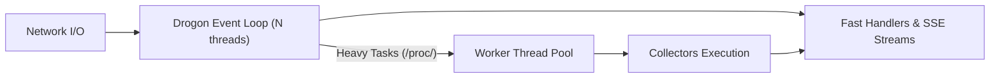

# NodePulse — High-Level Architecture

## 1. Architectural Overview & Style

NodePulse follows a **Layered Clean Architecture** combined with an **Asynchronous Reactive Event-Loop Engine**. The system is built around the separation of concerns, ensuring that kernel-level Linux data extraction is completely decoupled from HTTP protocol negotiation and serialization.

```mermaid
flowchart TD
    Client["HTTP / SSE / Prometheus Clients"] -->|HTTP / HTTPS| MW["Middleware Layer (Filters)"]
    subgraph "Drogon HTTP Server Runtime"
        MW -->|"1. AuthFilter (X-API-Key)"| MW2["2. RateLimitFilter (Token Bucket)"]
        MW2 --> C["Controllers Layer"]
    end

    subgraph "Application Core"
        C -->|"Invokes Service Methods"| S["Services Layer"]
        S -->|"Orchestrates & Computes Deltas"| D["Domain Layer (C++ Structs)"]
        S -->|"Queries Kernel Subsystems"| COL["Collectors Layer"]
        S -->|"Persists Historical Data"| R["Repositories Layer (Phase 14)"]
    end

    subgraph "Linux Kernel & Host OS"
        COL -->|Read| FS["/proc & /sys Filesystems"]
        COL -->|Syscalls| SC["statvfs(), uname(), gethostname()"]
        COL -->|D-Bus| DBUS["systemd (sd-bus)"]
        COL -->|Unix Socket| DOCKER["/var/run/docker.sock (libcurl)"]
    end

    subgraph "Persistence"
        R -.->|libpqxx (Optional)| PG[("PostgreSQL Database")]
    end
```

---

## 2. Architectural Layers

### 2.1 Middleware Layer (`src/middleware/`)
- Intercepts requests before reaching controllers.
- Enforces cross-cutting concerns:
  - **`AuthFilter`**: Validates the `X-API-Key` request header using constant-time comparison. Bypasses `/api/v1/health`.
  - **`RateLimitFilter`**: Tracks client request rates using an in-memory token-bucket algorithm. Returns HTTP 429 when exhausted.

### 2.2 Controllers Layer (`src/controllers/`)
- Acts as the HTTP adapter for the Drogon web framework.
- Validates request parameters (e.g. integer range check on `{pid}`).
- Invokes appropriate service layer methods.
- Serializes domain model structures into JSON using `nlohmann/json` or formats Prometheus metrics into text format.
- **Strict Invariant**: Controllers must NEVER directly open or parse files in `/proc`, `/sys`, or execute shell commands.

### 2.3 Services Layer (`src/services/`)
- Encapsulates application workflows and business logic.
- Coordinates collectors and calculates temporal deltas (e.g. CPU utilization percentages derived from jiffies over time intervals, network bandwidth bytes/sec).
- Manages concurrency boundaries, offloading heavy scans away from Drogon's primary event loop threads.

### 2.4 Collectors Layer (`src/collectors/`)
- Pure Linux subsystem observers.
- Reads virtual files (`/proc/stat`, `/proc/meminfo`, `/proc/cpuinfo`, `/proc/loadavg`, `/proc/uptime`, `/proc/net/dev`, `/proc/mounts`, `/proc/<pid>/*`, `/sys/class/net/*`).
- Executes POSIX system calls (`statvfs`, `uname`, `gethostname`).
- Queries systemd via D-Bus and the Docker Engine via `/var/run/docker.sock`.
- **Strict Invariant**: Collectors must NEVER depend on HTTP concepts, Drogon headers, or JSON serializations. They accept abstract stream readers or paths to ensure mockability in unit tests.

### 2.5 Domain Layer (`include/nodepulse/domain/`)
- Contains pure, strongly typed C++20 structures (`SystemInfo`, `CpuMetrics`, `MemoryMetrics`, etc.).
- Defines aggregates and value objects used across layer boundaries.
- Contains zero dependencies on HTTP or external databases.

### 2.6 Repositories Layer (`src/repositories/`)
- Handles persistence for historical telemetry snapshots (Phase 14).
- Implements asynchronous batch inserts to PostgreSQL via `libpqxx`.

### 2.7 Utilities Layer (`src/utils/`)
- Shared cross-cutting utilities:
  - Asynchronous structured logging (`spdlog`).
  - Configuration loader and validator.
  - Standard JSON error envelope generator.
  - Constant-time memory comparison for authentication.
  - Monotonic time calculation utilities.

---

## 3. Threading & Concurrency Model



- **Drogon I/O Event Loops**:
  - Configured to use $N$ event threads (typically matching CPU core count).
  - Handles non-blocking socket reads, writes, HTTP parsing, and SSE streaming chunk delivery.
- **Worker Thread Pool (Intentional Architectural Decision)**:
  - **Context & Intentional Decision**: Offloading heavy Linux subsystem scans (such as full process table traversals across hundreds of `/proc/[0-9]+` directories for `/api/v1/processes`) and external daemon socket queries to a worker thread pool is an **intentional architectural decision** made by the NodePulse engineering team (see [DEC-013](file:///home/devqii/workspace/nodepulse/DECISIONS.md#dec-013-worker-thread-pool-offloading-for-heavy-linux-subsystem-operations)).
  - **Specification Origin**: This design choice is an explicit engineering optimization to safeguard Drogon's reactive event loops and satisfy NFR-001 latency constraints; it was not an externally mandated requirement of the original product specification.
  - **Effect**: Eliminates event loop thread starvation during intensive host process table scans.
- **Database Background Thread (Phase 14)**:
  - Isolated background thread managing periodic PostgreSQL batch inserts without competing with HTTP requests.

