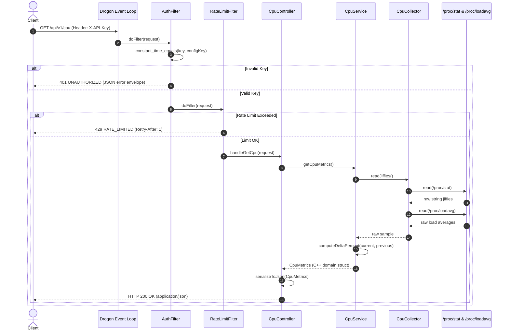
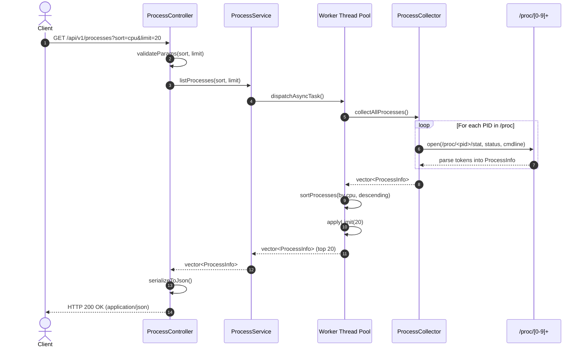
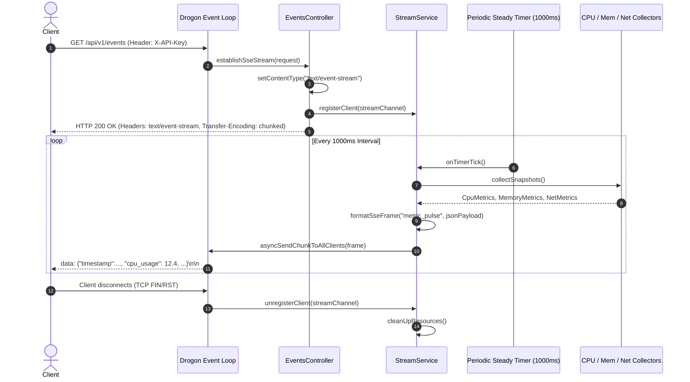
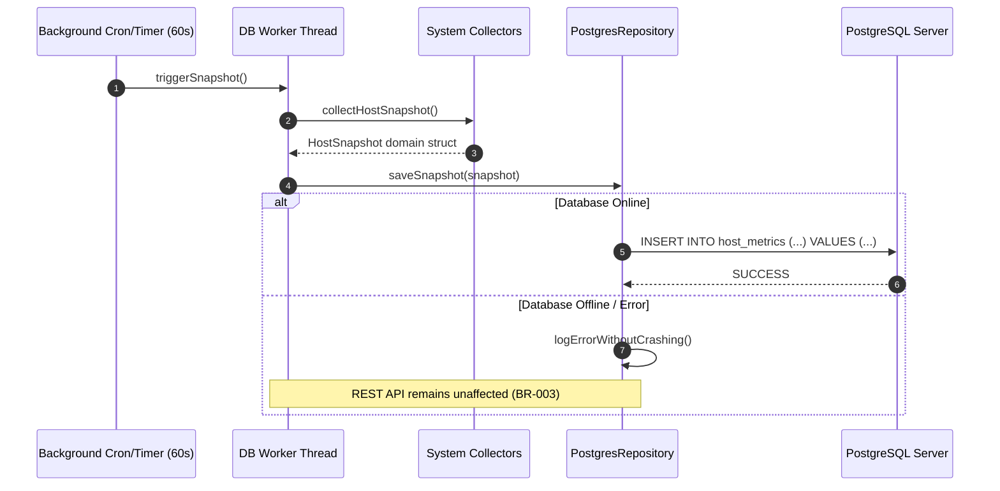

# NodePulse — Data Flow Architecture

This document diagrams the primary end-to-end data flows through NodePulse.

---

## 1. Flow 1: Synchronous Telemetry Request (`GET /api/v1/cpu`)



---

## 2. Flow 2: Process Table Enumeration (`GET /api/v1/processes`)



---

## 3. Flow 3: Server-Sent Events Live Stream (`GET /api/v1/events`)



---

## 4. Flow 4: Prometheus Scrape (`GET /metrics`)

```mermaid
sequenceDiagram
    autonumber
    actor Scraper as Prometheus Server
    participant Controller as MetricsController
    participant Exporter as MetricsService
    participant Collectors as System Collectors

    Scraper->>Controller: GET /metrics
    Controller->>Exporter: generatePrometheusExposition()
    Exporter->>Collectors: queryLatestSnapshots()
    Collectors-->>Exporter: domain metrics
    Exporter->>Exporter: formatGauge("nodepulse_cpu_usage_ratio", val)
    Exporter->>Exporter: formatGauge("nodepulse_memory_used_bytes", bytes)
    Exporter->>Exporter: formatCounter("nodepulse_network_receive_bytes_total", bytes)
    Exporter-->>Controller: std::string (text/plain; version=0.0.4)
    Controller-->>Scraper: HTTP 200 OK
```

---

## 5. Flow 5: Background PostgreSQL Metric Archival (Phase 14)



