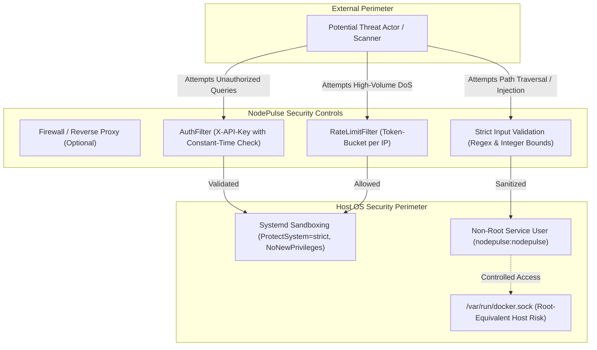

# NodePulse — Security Architecture & Threat Model

This document establishes the security architecture, threat model, authentication mechanisms, and privilege boundaries for NodePulse.

---

## 1. Threat Model & Security Posture

As a Linux host monitoring agent, NodePulse operates in a privileged proximity to the host kernel and system state. The security model is designed under the principle of **Defense in Depth** and **Least Privilege**.



---

## 2. Authentication & Credential Security

### 2.1 API Key Verification (`X-API-Key`)
- All endpoints under `/api/v1` (with the explicit exemption of `/api/v1/health`) require the client to supply an API key in the `X-API-Key` request header.
- The Prometheus exposition endpoint `GET /metrics` is secure-by-default and requires `X-API-Key`. It may be accessed without authentication ONLY when explicitly configured by setting `prometheus.require_auth: false` in `config.json`.
- **Timing Attack Mitigation**: Key comparison must use constant-time memory comparison (`CRYPTO_memcmp` or a custom unrolled loop in `src/utils/security_utils.cpp`). Standard `==` string comparisons are prohibited because early exits leak key length and prefix characters via timing channels.
- Missing or invalid keys immediately yield HTTP 401 `UNAUTHORIZED`.

### 2.2 Secure Credential Loading
- API keys and database credentials must only be loaded from:
  1. A root-owned, restricted-permission configuration file (e.g. `/etc/nodepulse/config.json` with permissions `0600` or `0640` owned by `root:nodepulse`).
  2. Protected environment variables (`NODEPULSE_API_KEY`, `NODEPULSE_DB_PASSWORD`).
- Secrets must never be hardcoded into source code or committed to Git.

### 2.3 Strict Redaction and Zero Logging
- Under no circumstances shall an API key or password be written to log files, terminal streams, or error responses.
- In error and audit log events, only masked representations or truncated hashes are permitted (e.g. `key_id: "np_live_...4a8f"`).

---

## 3. Rate Limiting & Denial of Service Protection

- An in-memory token-bucket rate limiter tracks request rates per client IP address.
- Configuration options:
  - `rate_limit_requests_per_minute`: default 120.
  - `rate_limit_burst_capacity`: default 30.
- When a client exhausts its quota:
  - The request is immediately rejected with HTTP 429 `RATE_LIMITED`.
  - The `Retry-After: <seconds>` HTTP header is set.
  - Processing terminates before any collector reads `/proc` or queries D-Bus, shielding the host CPU from exhaustion attacks.

---

## 4. Docker Socket Privilege Risk Analysis

> [!CAUTION]
> **CRITICAL SECURITY NOTICE**: Access to `/var/run/docker.sock` is functionally equivalent to having `root` privileges on the host operating system.

### 4.1 Root Equivalence Analysis
- The Docker daemon runs as `root` on standard Linux installations. Any client capable of issuing HTTP requests to the Docker Unix socket can instruct the daemon to create containers with root privileges, mount the host root filesystem (`-v /:/host`), or modify host kernel capabilities.
- **Do NOT falsely describe Docker socket access as "safe" merely because NodePulse provides read-only HTTP endpoints**. Even if NodePulse exposes only GET routes, if NodePulse's process or memory space were ever compromised, an attacker gaining control of the agent's file descriptors would inherit write access to the Docker socket.

### 4.2 Hard Safety Constraints
1. **Optional Integration**: Docker container inspection is entirely optional. If Docker is not required, the agent must run without mounting or opening `/var/run/docker.sock`.
2. **Prohibition of Privileged Containers**: NodePulse must NEVER be executed as a `--privileged` container. Running with `--privileged` disables all Linux namespace and seccomp isolations.
3. **Restricted Socket Permissions**: When Docker inspection is required, the `nodepulse` service user should belong only to the `docker` group and run under strict systemd process sandboxing.

---

## 5. Systemd Process Sandboxing & Hardening

When running as a systemd service, NodePulse must be confined using modern Linux namespace and cgroup security primitives:

```ini
[Service]
User=nodepulse
Group=nodepulse

# Prevent privilege escalation
NoNewPrivileges=true

# Filesystem protections
ProtectSystem=strict
ProtectHome=true
PrivateTmp=true
ProtectKernelTunables=true
ProtectKernelModules=true
ProtectControlGroups=true

# Restrict network protocols
RestrictAddressFamilies=AF_INET AF_INET6 AF_UNIX

# Capability restrictions
CapabilityBoundingSet=
AmbientCapabilities=
```

---

## 6. Input Validation & Parameter Sanitization

To eliminate directory traversal, command injection, and resource exhaustion:
1. **Process IDs (`{pid}`)**: Validated strictly as positive decimal integers (`pid >= 1`). If a runtime upper-bound check is performed, Linux `/proc/sys/kernel/pid_max` is authoritative; NodePulse does not enforce a hard-coded maximum invariant. Requests with non-positive, floating-point, or non-numeric PIDs fail immediately with HTTP 400 `INVALID_REQUEST`.
2. **Service Names (`{name}`)**: Validated against regex `^[a-zA-Z0-9_\-\.\@]+$` to prevent directory traversal outside systemd unit names.
3. **Query Limits (`limit`)**: Bounded to a maximum of 200 items to prevent unbounded heap allocations.

