# NodePulse — Domain Model Specification

This document details the domain models, aggregates, entities, and value objects representing Linux host resources and agent telemetry.

---

## 1. Domain Concept Map

```mermaid
classDiagram
    class SystemInfo {
        +String hostname
        +String osName
        +String osVersion
        +String kernelVersion
        +String architecture
        +UInt64 bootTimeUtc
        +Double uptimeSeconds
    }

    class CpuMetrics {
        +Double usagePercent
        +LoadAverage loadAverage
        +String modelName
        +UInt32 coreCount
        +List~CpuCoreMetrics~ cores
    }

    class LoadAverage {
        +Double oneMinute
        +Double fiveMinute
        +Double fifteenMinute
    }

    class MemoryMetrics {
        +UInt64 totalBytes
        +UInt64 freeBytes
        +UInt64 availableBytes
        +UInt64 buffersBytes
        +UInt64 cachedBytes
        +Double usagePercent
        +UInt64 swapTotalBytes
        +UInt64 swapFreeBytes
        +UInt64 swapUsedBytes
        +Double swapUsagePercent
    }

    class DiskPartitionMetrics {
        +String filesystem
        +String mountPoint
        +String fstype
        +UInt64 totalBytes
        +UInt64 usedBytes
        +UInt64 freeBytes
        +Double usagePercent
        +UInt64 inodesTotal
        +UInt64 inodesFree
    }

    class NetworkInterfaceMetrics {
        +String name
        +String macAddress
        +String operstate
        +UInt64 speedMbps
        +UInt64 rxBytes
        +UInt64 txBytes
        +UInt64 rxPackets
        +UInt64 txPackets
        +UInt64 rxErrors
        +UInt64 txErrors
    }

    class ProcessInfo {
        +Int32 pid
        +String name
        +String user
        +String state
        +Double cpuPercent
        +UInt64 memoryRssBytes
        +String cmdline
    }

    class ServiceInfo {
        +String name
        +String description
        +String loadState
        +String activeState
        +String subState
        +String unitFileState
    }

    class ServiceDetail {
        +String name
        +String description
        +String loadState
        +String activeState
        +String subState
        +String unitFileState
        +Int32 mainPid
        +UInt32 restartCount
        +UInt64 activeEnterTimestampUtc
        +UInt64 memoryCurrentBytes
    }

    class ContainerSummary {
        +String id
        +List~String~ names
        +String image
        +String status
        +String state
        +UInt64 created
    }

    CpuMetrics *-- LoadAverage
```

---

## 2. Entities vs Value Objects

In accordance with Domain-Driven Design (DDD):

### 2.1 Entities (Possessing Identity)
- **`ProcessInfo` & `ProcessDetail`**: Identified uniquely on a host by its integer Process ID (`pid`). Processes have a lifecycle (running, sleeping, zombie, terminated).
- **`ServiceInfo` & `ServiceDetail`**: Identified uniquely by its systemd unit name (e.g. `nodepulse.service`, `sshd.service`).
- **`ContainerSummary` & `ContainerDetail`**: Identified uniquely by a 64-character hexadecimal Docker container ID (`id`).

### 2.2 Value Objects (Immutable Measurement Snapshots)
- **`SystemInfo`**: Snapshot of host identity and kernel version.
- **`CpuMetrics`**, **`CpuCoreMetrics`**, **`LoadAverage`**: Ephemeral snapshots of processor execution and load over a measurement window.
- **`MemoryMetrics`**: Point-in-time calculation of RAM and swap utilization.
- **`DiskPartitionMetrics`**: Point-in-time storage allocation on a mount point.
- **`NetworkInterfaceMetrics`**: Point-in-time interface traffic counters.
- **`MetricPulse`**: Aggregated composite snapshot emitted across Server-Sent Events.

---

## 3. Aggregate Roots and Boundaries

### 3.1 Host Telemetry Aggregate (`HostSnapshot`)
The `HostSnapshot` represents a unified point-in-time view of the host machine, composed of:
- `SystemInfo`
- `CpuMetrics`
- `MemoryMetrics`
- `List<DiskPartitionMetrics>`
- `List<NetworkInterfaceMetrics>`

This aggregate root is utilized during PostgreSQL historical metric persistence (Phase 14) and periodic SSE pulse emission (Phase 12).

### 3.2 Process Subsystem Boundary
The process domain is bounded by `/proc/[0-9]+`. Individual process snapshots are ephemeral because Linux PIDs can be recycled rapidly by the kernel. Lookups for a specific PID return an optional entity (`std::optional<ProcessDetail>`), which may be null if the process terminated between directory listing and file inspection.

### 3.3 Container Subsystem Boundary
The container domain is separated from host processes. Containers run within host PID and mount namespaces, but their identification, port mappings, and lifecycle are mediated through the Docker Engine daemon. If the Docker daemon is unreachable, the container domain boundary gracefully yields unavailable states without invalidating host metrics.

