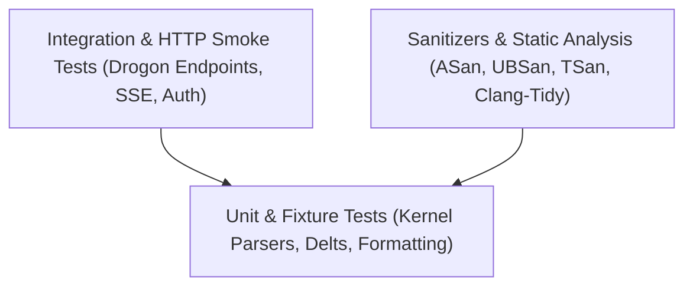

# NodePulse — Testing Strategy & Quality Assurance

This document defines the multi-tiered testing strategy, fixture harness, integration testing methodology, and sanitizer verification for NodePulse.

---

## 1. Testing Pyramid & Taxonomy



NodePulse enforces four distinct testing tiers:
1. **Fixture-Driven Unit Tests**: Isolate parser logic from the Linux kernel using simulated file data in `tests/fixtures/proc/`.
2. **Component & Service Unit Tests**: Verify delta calculations, sorting algorithms, and rate limiting logic.
3. **HTTP Integration Tests**: Spin up an in-process Drogon instance on an ephemeral port to verify routing, headers, middleware, and SSE streaming.
4. **Sanitizer & Memory Checks**: Automated builds under AddressSanitizer (ASan), UndefinedBehaviorSanitizer (UBSan), and ThreadSanitizer (TSan).

---

## 2. Fixture-Driven `/proc` Parser Testing

To ensure deterministic testing on any developer machine (including macOS or CI containers without root), all collectors must support parsing from abstract streams or mock root directories (`/tests/fixtures/proc/`).

### 2.1 Fixture Directory Structure
```
tests/fixtures/
├── etc/
│   └── os-release
└── proc/
    ├── cpuinfo
    ├── loadavg
    ├── meminfo
    ├── mounts
    ├── net/
    │   └── dev
    ├── stat
    ├── uptime
    └── 1024/
        ├── cmdline
        ├── stat
        └── status
```

### 2.2 Example Fixture Test Pattern (GoogleTest)
```cpp
#include <gtest/gtest.h>
#include <nodepulse/collectors/cpu_collector.hpp>

TEST(CpuCollectorTest, ParsesNominalProcStatCorrectly) {
    std::string mock_stat = 
        "cpu  101320 2100 34200 8920300 1200 40 500 0 0 0\n"
        "cpu0 50660 1050 17100 4460150 600 20 250 0 0 0\n"
        "cpu1 50660 1050 17100 4460150 600 20 250 0 0 0\n";

    nodepulse::collectors::CpuCollector collector;
    auto result = collector.parse_stat_buffer(mock_stat);

    ASSERT_TRUE(result.has_value());
    EXPECT_EQ(result->cores.size(), 2);
    EXPECT_EQ(result->cores[0].user_jiffies, 50660);
}
```

---

## 3. Integration Testing Strategy

Integration tests in `tests/integration/` spin up the Drogon HTTP engine and execute live HTTP requests using Drogon's `HttpClient` or `libcurl`.

Key integration scenarios:
- **Health Check**: Verify `GET /api/v1/health` succeeds with HTTP 200 without `X-API-Key`.
- **Authentication Filter**:
  - Request without `X-API-Key` returns HTTP 401 `UNAUTHORIZED`.
  - Request with invalid `X-API-Key` returns HTTP 401 `UNAUTHORIZED`.
  - Request with valid `X-API-Key` returns HTTP 200.
- **Rate Limiting**: Sending a burst of 150 requests within 1 second triggers HTTP 429 `RATE_LIMITED` with `Retry-After`.
- **SSE Stream**: Connect to `/api/v1/events`, verify chunk header `Content-Type: text/event-stream`, read 3 consecutive `metric_pulse` frames, and verify clean disconnect.

---

## 4. Sanitizers & Leak Detection

### 4.1 AddressSanitizer & UndefinedBehaviorSanitizer (ASan/UBSan)
Ensures zero buffer overflows, use-after-free, double-free, or undefined pointer arithmetic:
```bash
cmake -B build-asan -G Ninja -DENABLE_SANITIZERS=ON -DBUILD_TESTING=ON
cmake --build build-asan
ctest --test-dir build-asan --output-on-failure
```

### 4.2 ThreadSanitizer (TSan)
Ensures zero data races between Drogon event loops and background worker threads:
```bash
cmake -B build-tsan -G Ninja -DENABLE_TSAN=ON -DBUILD_TESTING=ON
cmake --build build-tsan
ctest --test-dir build-tsan --output-on-failure
```

---

## 5. Code Coverage Requirements

- **Target**: Greater than **80%** line coverage across `src/`.
- Coverage reports generated via `gcov` and `lcov`:
```bash
cmake -B build-cov -G Ninja -DENABLE_COVERAGE=ON
cmake --build build-cov
ctest --test-dir build-cov
lcov --capture --directory build-cov --output-file coverage.info
genhtml coverage.info --output-directory coverage_html
```

