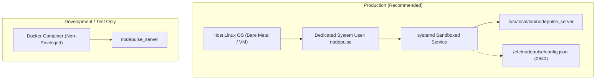

# NodePulse — Deployment Runbook

This document details the production deployment procedures, service user provisioning, directory permissions, and security constraints for NodePulse.

---

## 1. Deployment Topology & Modes



---

## 2. Security Boundaries & Invariants

> [!CAUTION]
> **DOCKER SOCKET SECURITY PERIMETER**: If mounting `/var/run/docker.sock` to enable Docker inspection, understand that any access to this socket confers **root-equivalent privileges** over the host.
> - **Never describe Docker socket access as "safe"** merely because NodePulse provides read-only HTTP endpoints.
> - **Never run NodePulse with `--privileged`**.

---

## 3. Production Runtime Prerequisites

NodePulse is built as a dynamically linked Linux binary. It expects required runtime shared libraries to be available through the host's standard system dynamic linker (`ld.so`):

| Shared Library Soname | Component | Notes |
|---|---|---|
| `libdrogon.so.1` | Drogon Framework | High-performance C++ HTTP server engine |
| `libtrantor.so.1` | Trantor Network Engine | Event loop & socket transport |
| `libjsoncpp.so.*` | JsonCpp | JSON serialization support for Drogon |
| `libspdlog.so.*` | spdlog | Structured fast logging engine |
| `libfmt.so.*` | fmt | String formatting engine used by spdlog |
| `libpq.so.5` | PostgreSQL Client | Client driver for metric persistence |
| `libsystemd.so.0` | systemd | D-Bus service inspection (loaded at runtime via `dlopen`) |
| `libc.so.6`, `libstdc++.so.6` | Standard C / C++ Runtimes | Base system runtime libraries |

> [!IMPORTANT]
> **Dynamic Linker Resolution**: All shared libraries must be located in standard system library directories (e.g., `/usr/lib/x86_64-linux-gnu`, `/usr/lib64`, `/usr/local/lib`) or in a path registered in `/etc/ld.so.conf.d/`.
> After placing shared libraries in system directories, run `sudo ldconfig`.
> Verify that all dependencies resolve cleanly before starting the service:
> ```bash
> ldd /usr/local/bin/nodepulse_server
> ```
> There must be zero lines containing `=> not found`.

---

## 4. Production Installation Runbook (Native Linux)

### Step 1: Provision Dedicated Service User & Group
Create an unprivileged system user without shell or home directory:
```bash
sudo groupadd --system nodepulse
sudo useradd --system --gid nodepulse --no-create-home --shell /usr/sbin/nologin nodepulse
```

### Step 2: Install Binary
Copy the compiled release binary to `/usr/local/bin/`:
```bash
sudo cp build-release/nodepulse_server /usr/local/bin/nodepulse_server
sudo chown root:root /usr/local/bin/nodepulse_server
sudo chmod 0755 /usr/local/bin/nodepulse_server
```

### Step 3: Configure Directory & Permissions
Create the configuration directory and install `config.json`:
```bash
sudo mkdir -p /etc/nodepulse
sudo cp config/config.example.json /etc/nodepulse/config.json

# Restrict configuration access: readable only by root and nodepulse group
sudo chown root:nodepulse /etc/nodepulse/config.json
sudo chmod 0640 /etc/nodepulse/config.json
```

Generate a cryptographically secure API key and insert it into `/etc/nodepulse/config.json`:
```bash
NEW_KEY=$(openssl rand -hex 24)
sudo sed -i "s/CHANGE_ME_SECURE_API_KEY/$NEW_KEY/" /etc/nodepulse/config.json
```

### Step 4: Install Systemd Service Unit
```bash
sudo cp infrastructure/systemd/nodepulse.service /etc/systemd/system/
sudo systemctl daemon-reload
sudo systemctl enable --now nodepulse
```

### Step 5: Verify Deployment Vitality
```bash
# Verify systemd service status
sudo systemctl status nodepulse

# Validate unauthenticated health check
curl -s http://127.0.0.1:8080/api/v1/health | jq .
```

---

## 5. Development Container Deployment (Non-Privileged)

For development or test environments only:

```bash
docker run -d \
  --name nodepulse-dev \
  --restart unless-stopped \
  -p 8080:8080 \
  -e NODEPULSE_API_KEY="test-key-12345" \
  -v /proc:/host/proc:ro \
  -v /sys:/host/sys:ro \
  nodepulse:latest
```

*Note: The container MUST NOT run with `--privileged`.*

