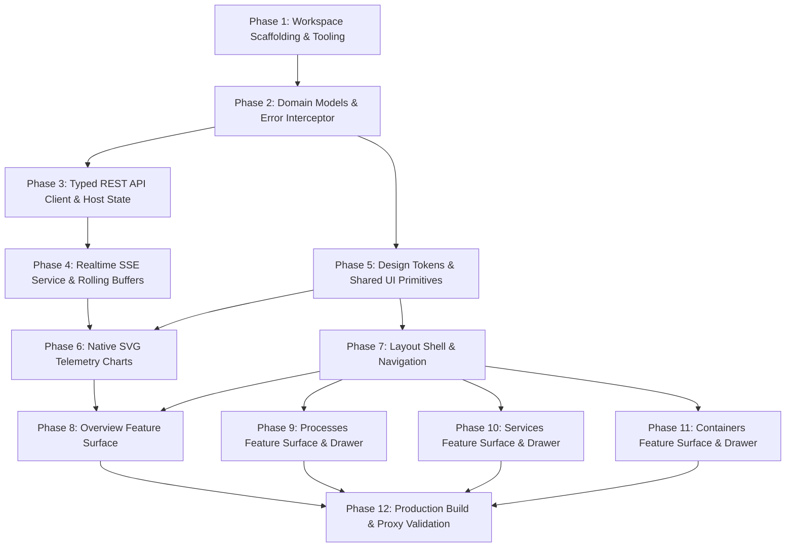

# NodePulse — Angular Frontend Implementation Plan

- **Document Identifier**: `PLAN-FRONTEND-001`
- **Plan Date**: 2026-10-08
- **Specification Reference**: [docs/superpowers/specs/2026-10-08-nodepulse-angular-frontend-design.md](file:///home/devqii/workspace/nodepulse/docs/superpowers/specs/2026-10-08-nodepulse-angular-frontend-design.md)
- **Status**: Draft / Ready for User Execution Selection
- **Target Subsystem**: `apps/web/`
- **Architecture**: Single-host Angular operator console behind same-origin reverse proxy

---

## 1. Overview & Execution Principles

This implementation plan defines the complete step-by-step engineering roadmap to construct the NodePulse Angular frontend dashboard in `apps/web/`.

### 1.1 Prime Directives
1. **Strictly Additive**: Zero modifications to existing C++20 backend code (`src/`, `include/`, `apps/server/`, `CMakeLists.txt`).
2. **Test-Driven Discipline**: Every service, utility, model parser, and component must be developed with corresponding unit tests executed via the Angular CLI's Vitest runner.
3. **No Secret Ingestion**: The frontend must never prompt for, store, or bundle NodePulse API keys. All communication uses relative same-origin paths (`/api/v1/*`, `/api/v1/events`).
4. **Honest Telemetry Semantics**: No interpolation over gaps; bounded rolling buffers capped at 60 samples; independent `agentStatus` and `streamStatus` signals.
5. **Zero Unjustified Dependencies**: Standalone Angular, Signals, RxJS, Tailwind CSS, native SVG charts. No third-party UI dashboard templates or charting libraries.

---

## 2. Phase Breakdown & Dependency Flow



---

## 3. Detailed Implementation Tasks

### Phase 1: Workspace Scaffolding & Tooling Setup

#### Task 1.1: Angular Workspace Scaffolding in `apps/web`
- **Objective**: Scaffold a clean, modern Angular application in `apps/web/` configured with standalone components, Vitest test runner, strict TypeScript, and Tailwind CSS.
- **Files to Create / Modify**:
  - `apps/web/package.json`
  - `apps/web/angular.json`
  - `apps/web/tsconfig.json`
  - `apps/web/tsconfig.app.json`
  - `apps/web/tsconfig.spec.json`
  - `apps/web/src/main.ts`
  - `apps/web/src/index.html`
  - `apps/web/src/styles.css`
  - `apps/web/src/app/app.config.ts`
  - `apps/web/src/app/app.component.ts`
  - `apps/web/src/app/app.component.html`
  - `apps/web/src/app/app.component.spec.ts`
- **Interface / Contract**:
  - `apps/web` must build cleanly via `npm run build`.
  - Initial tests pass via `npm test`.
  - App root renders basic `<router-outlet>`.
- **Verification Commands**:
  ```bash
  cd /home/devqii/workspace/nodepulse/apps/web
  npm run build -- --configuration=production
  npm test -- --watch=false
  ```
- **Done Criteria**: Angular app builds without errors; zero TypeScript warnings under strict flags; default test passes.

---

### Phase 2: Domain Models & Error Interceptor

#### Task 2.1: Strongly Typed Domain Models
- **Objective**: Define TypeScript domain interfaces matching the backend contracts in `docs/domain/DATA_MODEL.md` and `docs/api/API.md`.
- **Files to Create**:
  - `apps/web/src/app/core/models/system.model.ts` (`HealthResponse`, `SystemInfo`)
  - `apps/web/src/app/core/models/cpu.model.ts` (`CpuMetrics`, `CpuCoreMetrics`, `LoadAverage`)
  - `apps/web/src/app/core/models/memory.model.ts` (`MemoryMetrics`)
  - `apps/web/src/app/core/models/disk.model.ts` (`DiskPartitionMetrics`)
  - `apps/web/src/app/core/models/network.model.ts` (`NetworkInterfaceMetrics`)
  - `apps/web/src/app/core/models/process.model.ts` (`ProcessInfo`, `ProcessDetail`)
  - `apps/web/src/app/core/models/service.model.ts` (`ServiceInfo`, `ServiceDetail`)
  - `apps/web/src/app/core/models/container.model.ts` (`ContainerSummary`, `ContainerDetail`)
  - `apps/web/src/app/core/models/pulse.model.ts` (`MetricPulse`, `TelemetrySample<T>`)
  - `apps/web/src/app/core/models/api-error.model.ts` (`ApiErrorEnvelope`, `ApiErrorDetail`)
- **Interface / Contract**:
  - Export all types. `pulse.model.ts` defines:
    ```typescript
    export interface TelemetrySample<T> {
      timestamp: string;
      value: T | null;
    }
    ```
- **Verification Commands**:
  ```bash
  cd /home/devqii/workspace/nodepulse/apps/web
  npx tsc --noEmit
  ```
- **Done Criteria**: All domain types export cleanly without type errors.

#### Task 2.2: Global API Error Interceptor
- **Objective**: Implement and test `error.interceptor.ts` to unmarshal backend `ApiErrorEnvelope` (from `docs/api/ERRORS.md`) and extract `Retry-After` headers on 429 errors.
- **Files to Create**:
  - `apps/web/src/app/core/api/error.interceptor.spec.ts` (Test first)
  - `apps/web/src/app/core/api/error.interceptor.ts` (Implementation)
- **TDD Steps**:
  1. Write tests in `error.interceptor.spec.ts` using `HttpTestingController` validating error handling for 400 (`INVALID_REQUEST`), 401 (`UNAUTHORIZED`), 429 (`RATE_LIMITED` with `Retry-After`), 500 (`COLLECTOR_FAILURE`), and 503 (`DOCKER_UNAVAILABLE`).
  2. Implement interceptor parsing HTTP errors into typed `ApiErrorEnvelope`.
  3. Register interceptor in `app.config.ts` via `provideHttpClient(withInterceptors([errorInterceptor]))`.
- **Verification Commands**:
  ```bash
  cd /home/devqii/workspace/nodepulse/apps/web
  npm test -- --include=src/app/core/api/error.interceptor.spec.ts --watch=false
  ```
- **Done Criteria**: 100% test pass rate for all error envelope unmarshaling scenarios.

---

### Phase 3: Typed REST API Client & Host State Service

#### Task 3.1: Typed `ApiClientService`
- **Objective**: Provide typed HTTP client methods targeting relative endpoints `/api/v1/*`.
- **Files to Create**:
  - `apps/web/src/app/core/api/api-client.service.spec.ts` (Test first)
  - `apps/web/src/app/core/api/api-client.service.ts` (Implementation)
- **TDD Steps**:
  1. Write unit tests for: `getHealth()`, `getSystem()`, `getCpu()`, `getMemory()`, `getDisks()`, `getNetwork()`, `getProcesses(sort, limit)`, `getProcessDetail(pid)`, `getServices(state, limit)`, `getServiceDetail(name)`, `getContainers()`, and `getContainerDetail(id)`.
  2. Implement `ApiClientService` utilizing Angular's `HttpClient`.
- **Verification Commands**:
  ```bash
  cd /home/devqii/workspace/nodepulse/apps/web
  npm test -- --include=src/app/core/api/api-client.service.spec.ts --watch=false
  ```
- **Done Criteria**: All 12 endpoint methods tested with URL and query parameter verification.

#### Task 3.2: `ConnectionStateService` & `HostStateService`
- **Objective**: Implement decoupled state management for `agentStatus` (`'unknown'` | `'healthy'` | `'unreachable'`) and `streamStatus` (`'connecting'` | `'connected'` | `'reconnecting'` | `'paused'`), alongside central Signal stores for host identity and vitals.
- **Files to Create**:
  - `apps/web/src/app/core/services/connection-state.service.spec.ts`
  - `apps/web/src/app/core/services/connection-state.service.ts`
  - `apps/web/src/app/core/services/host-state.service.spec.ts`
  - `apps/web/src/app/core/services/host-state.service.ts`
- **TDD Steps**:
  1. Test `ConnectionStateService`: verifying `agentStatus` updates upon health probe success/failure, and `streamStatus` transitions independently.
  2. Test `HostStateService`: initial REST snapshot population (`fetchInitialVitals()`), updating `systemInfo`, `cpuMetrics`, `memoryMetrics`, `diskMetrics`, `networkMetrics`.
- **Verification Commands**:
  ```bash
  cd /home/devqii/workspace/nodepulse/apps/web
  npm test -- --include=src/app/core/services/*.spec.ts --watch=false
  ```
- **Done Criteria**: Tests pass confirming decoupled status signals and reactive state derivations.

---

### Phase 4: Realtime SSE Service & Bounded Telemetry Buffers

#### Task 4.1: Native EventSource `SseService`
- **Objective**: Wrap native browser `EventSource` to consume `/api/v1/events`, handle stream lifecycles, and dispatch `metric_pulse` events without inspecting comment lines.
- **Files to Create**:
  - `apps/web/src/app/core/api/sse.service.spec.ts`
  - `apps/web/src/app/core/api/sse.service.ts`
- **TDD Steps**:
  1. Mock `EventSource` in Vitest to test:
     - `open` event setting `streamStatus` to `'connected'`.
     - `error` event setting `streamStatus` to `'reconnecting'` without mutating `agentStatus`.
     - `metric_pulse` parsing payload into `MetricPulse`.
     - `pause()` closing `EventSource` and setting `streamStatus` to `'paused'`.
     - `resume()` opening new `EventSource` and triggering REST snapshot sync.
  2. Implement `SseService`.
- **Verification Commands**:
  ```bash
  cd /home/devqii/workspace/nodepulse/apps/web
  npm test -- --include=src/app/core/api/sse.service.spec.ts --watch=false
  ```
- **Done Criteria**: Full lifecycle coverage of SSE connection, stream failure, user pause, and resume.

#### Task 4.2: Bounded Rolling Telemetry Buffer Management
- **Objective**: Manage rolling telemetry buffers (`cpuRollingBuffer`, `memoryRollingBuffer`, `networkRxRollingBuffer`, `networkTxRollingBuffer`) capped at the last 60 samples with timestamp awareness and honest gap preservation.
- **Files to Create**:
  - `apps/web/src/app/core/services/telemetry-buffer.spec.ts`
  - `apps/web/src/app/core/services/telemetry-buffer.util.ts`
- **TDD Steps**:
  1. Test ring buffer utility:
     - Appending samples shifts array to strictly $\le 60$ entries.
     - `value === null` preserved without NaN coercion.
     - Timestamp preservation for time-axis scaling.
  2. Implement utility and integrate with `HostStateService`.
- **Verification Commands**:
  ```bash
  cd /home/devqii/workspace/nodepulse/apps/web
  npm test -- --include=src/app/core/services/telemetry-buffer.spec.ts --watch=false
  ```
- **Done Criteria**: Buffer boundary invariants and gap preservation verified.

---

### Phase 5: Design Tokens & Shared UI Primitives

#### Task 5.1: Tailwind Theme & Design Token Integration
- **Objective**: Configure Tailwind CSS with the approved dark-first color tokens (`zinc-950` base, `zinc-900` surface, `zinc-800` borders, `zinc-100` text, muted semantic emerald/amber/rose/zinc, monospace technical font).
- **Files to Modify**:
  - `apps/web/src/styles.css`
  - Tailwind build configuration (as supported by the selected Angular CLI setup)
- **Verification Commands**:
  ```bash
  cd /home/devqii/workspace/nodepulse/apps/web
  npm run build
  ```
- **Done Criteria**: Design tokens generate expected utility classes without build warnings.

#### Task 5.2: Shared Presentation Primitives
- **Objective**: Implement reusable standalone UI primitives with accessible contrast and keyboard support.
- **Files to Create**:
  - `apps/web/src/app/shared/ui/status-badge/status-badge.component.ts` & `.spec.ts`
  - `apps/web/src/app/shared/ui/metric-card/metric-card.component.ts` & `.spec.ts`
  - `apps/web/src/app/shared/ui/data-table/data-table.component.ts` & `.spec.ts`
  - `apps/web/src/app/shared/ui/empty-state/empty-state.component.ts` & `.spec.ts`
- **TDD Steps**:
  1. Test `StatusBadgeComponent`: renders text labels alongside semantic colors (`HEALTHY`, `WARMING UP`, `FAILED`, `ACTIVE`, `INACTIVE`, `RECONNECTING`, `PAUSED`).
  2. Test `MetricCardComponent`: monospace value display, subtext labels, neutral percentage rendering.
  3. Test `DataTableComponent`: accessible table layout, column sorting events, responsive horizontal overflow container.
  4. Test `EmptyStateComponent`: custom icon, title, description rendering.
- **Verification Commands**:
  ```bash
  cd /home/devqii/workspace/nodepulse/apps/web
  npm test -- --include=src/app/shared/ui/**/*.spec.ts --watch=false
  ```
- **Done Criteria**: All shared UI components tested for accessibility, label presence, and DOM structure.

#### Task 5.3: Responsive Inspection Drawer Primitive
- **Objective**: Implement `DrawerComponent` supporting desktop slide-over panel, mobile full-screen overlay sheet, keyboard `Escape` dismissal, and backdrop click.
- **Files to Create**:
  - `apps/web/src/app/shared/ui/drawer/drawer.component.ts` & `.spec.ts`
- **TDD Steps**:
  1. Write tests verifying:
     - Emits `close` event on `Escape` key press.
     - Emits `close` event on backdrop click.
     - Traps focus inside drawer when active.
     - Renders header title and content projection (`<ng-content>`).
  2. Implement standalone `DrawerComponent`.
- **Verification Commands**:
  ```bash
  cd /home/devqii/workspace/nodepulse/apps/web
  npm test -- --include=src/app/shared/ui/drawer/*.spec.ts --watch=false
  ```
- **Done Criteria**: Keyboard navigation and responsive overlay styles verified.

---

### Phase 6: Native SVG Telemetry Charts

#### Task 6.1: Native SVG Sparkline Component
- **Objective**: Implement zero-dependency `<sparkline>` SVG component for inline trend display.
- **Files to Create**:
  - `apps/web/src/app/shared/charts/sparkline/sparkline.component.ts` & `.spec.ts`
- **TDD Steps**:
  1. Write tests verifying:
     - Mathematical coordinate mapping from numeric array to SVG `<polyline>` points.
     - Empty array renders flat baseline.
     - Preserves nulls as disconnected segments.
  2. Implement `SparklineComponent`.
- **Verification Commands**:
  ```bash
  cd /home/devqii/workspace/nodepulse/apps/web
  npm test -- --include=src/app/shared/charts/sparkline/*.spec.ts --watch=false
  ```
- **Done Criteria**: SVG points generated accurately; zero canvas dependencies.

#### Task 6.2: Native SVG Rolling Area Chart Component
- **Objective**: Implement zero-dependency `<rolling-area-chart>` rendering recent telemetry samples (up to 60 samples) with baseline fill, dual-trace support (for RX/TX), and visible gap preservation.
- **Files to Create**:
  - `apps/web/src/app/shared/charts/rolling-area-chart/rolling-area-chart.component.ts` & `.spec.ts`
- **TDD Steps**:
  1. Write tests verifying:
     - Input `TelemetrySample<number | null>[]` converted to SVG `<path>` with area fill.
     - Dual-trace rendering for network RX and TX.
     - Gaps (`null` values) rendered as distinct breaks in the path without synthetic interpolation.
     - Responsively scales width and height via `viewBox`.
  2. Implement `RollingAreaChartComponent`.
- **Verification Commands**:
  ```bash
  cd /home/devqii/workspace/nodepulse/apps/web
  npm test -- --include=src/app/shared/charts/rolling-area-chart/*.spec.ts --watch=false
  ```
- **Done Criteria**: Chart paths calculate cleanly; gaps preserved; pure SVG DOM.

---

### Phase 7: Application Layout Shell & Navigation

#### Task 7.1: Shell, Sidebar, and Header Components
- **Objective**: Build the application frame with responsive navigation (desktop fixed sidebar, mobile top bar with hamburger menu), stream pause/resume control, and separate `agentStatus` and `streamStatus` badges.
- **Files to Create**:
  - `apps/web/src/app/layout/sidebar/sidebar.component.ts` & `.spec.ts`
  - `apps/web/src/app/layout/header/header.component.ts` & `.spec.ts`
  - `apps/web/src/app/layout/shell/shell.component.ts` & `.spec.ts`
  - `apps/web/src/app/app.routes.ts`
- **TDD Steps**:
  1. Test `SidebarComponent`: renders 4 primary links (`/overview`, `/processes`, `/services`, `/containers`), displays hostname from `HostStateService`, and active route styling.
  2. Test `HeaderComponent`: displays separate `agentStatus` badge and `streamStatus` badge; pause/resume button triggers `SseService` toggle; mobile menu toggle emits event.
  3. Test `ShellComponent`: manages mobile drawer state and content projection for `<router-outlet>`.
  4. Configure standalone routes in `app.routes.ts` with lazy loading.
- **Verification Commands**:
  ```bash
  cd /home/devqii/workspace/nodepulse/apps/web
  npm test -- --include=src/app/layout/**/*.spec.ts --watch=false
  ```
- **Done Criteria**: Shell components pass all tests; routes navigate cleanly.

---

### Phase 8: Feature — Overview Surface (`/overview`)

#### Task 8.1: Overview Vitals & Subsystem Cards
- **Objective**: Implement the `/overview` orchestrator and its constituent telemetry cards (Host Identity, CPU, Memory, Network, Filesystems, Top Processes by CPU).
- **Files to Create**:
  - `apps/web/src/app/features/overview/components/host-vitals/host-vitals.component.ts` & `.spec.ts`
  - `apps/web/src/app/features/overview/components/cpu-card/cpu-card.component.ts` & `.spec.ts`
  - `apps/web/src/app/features/overview/components/memory-card/memory-card.component.ts` & `.spec.ts`
  - `apps/web/src/app/features/overview/components/network-card/network-card.component.ts` & `.spec.ts`
  - `apps/web/src/app/features/overview/components/disks-card/disks-card.component.ts` & `.spec.ts`
  - `apps/web/src/app/features/overview/components/top-processes/top-processes.component.ts` & `.spec.ts`
  - `apps/web/src/app/features/overview/overview.component.ts` & `.spec.ts`
- **TDD Steps**:
  1. Test `HostVitalsComponent`: renders hostname, OS name/version, kernel, architecture, uptime, boot time.
  2. Test `CpuCardComponent`: displays usage %, `warming_up` badge when null, load averages (1m, 5m, 15m), and rolling chart.
  3. Test `MemoryCardComponent`: displays RAM used/total, buffers/cached, swap usage %, and rolling chart.
  4. Test `NetworkCardComponent`: displays headline RX/TX from SSE, per-interface metadata and error counters from REST, and dual-trace chart.
  5. Test `DisksCardComponent`: renders mount points, filesystem types, capacity bars.
  6. Test `TopProcessesComponent`: queries `GET /api/v1/processes?sort=cpu&limit=5`, displays top 5 processes, row click navigates to `/processes?pid=<pid>`.
  7. Test `OverviewComponent`: coordinates data fetching from `GET /api/v1/health`, `/system`, `/cpu`, `/memory`, `/disks`, `/network`, `/processes?sort=cpu&limit=5`.
- **Verification Commands**:
  ```bash
  cd /home/devqii/workspace/nodepulse/apps/web
  npm test -- --include=src/app/features/overview/**/*.spec.ts --watch=false
  ```
- **Done Criteria**: All Overview components verified; zero arbitrary percentage warning thresholds.

---

### Phase 9: Feature — Processes Surface & Inspection Drawer

#### Task 9.1: Process Table & Inspection Drawer
- **Objective**: Implement `/processes` route with sortable process table, limit selector, manual refresh trigger, and deep-linked inspection drawer driven by query param `?pid=<pid>`.
- **Files to Create**:
  - `apps/web/src/app/features/processes/components/process-detail-drawer/process-detail-drawer.component.ts` & `.spec.ts`
  - `apps/web/src/app/features/processes/processes.component.ts` & `.spec.ts`
- **TDD Steps**:
  1. Test `ProcessDetailDrawerComponent`: queries `GET /api/v1/processes/{pid}`, displays PID, PPID, name, user, state, CPU %, RSS, VMS, threads, open FDs, start time, cmdline, and working directory.
  2. Test `ProcessesComponent`:
     - Sort toggling (`cpu`, `memory`, `pid`) dispatches updated API query.
     - Limit selector (`25`, `50`, `100`, `200`) updates query.
     - Manual refresh button triggers fresh fetch.
     - Row click updates router query params to `?pid=<pid>`.
     - Drawer close clears query param `?pid=null`.
- **Verification Commands**:
  ```bash
  cd /home/devqii/workspace/nodepulse/apps/web
  npm test -- --include=src/app/features/processes/**/*.spec.ts --watch=false
  ```
- **Done Criteria**: Process sorting, manual refresh, drawer deep-linking, and URL synchronization verified.

---

### Phase 10: Feature — Services Surface & Inspection Drawer

#### Task 10.1: Systemd Services Table & Inspection Drawer
- **Objective**: Implement `/services` route with state filtering tabs, limit selector, unit table, and inspection drawer `?name=<unit_name>`, with conditional `main_pid >= 1` link navigation.
- **Files to Create**:
  - `apps/web/src/app/features/services/components/service-detail-drawer/service-detail-drawer.component.ts` & `.spec.ts`
  - `apps/web/src/app/features/services/services.component.ts` & `.spec.ts`
- **TDD Steps**:
  1. Test `ServiceDetailDrawerComponent`:
     - Queries `GET /api/v1/services/{name}`, renders unit details.
     - When `main_pid >= 1`, renders clickable link navigating to `/processes?pid=<main_pid>`.
     - When `main_pid <= 0`, renders `" — "` non-clickable text.
  2. Test `ServicesComponent`:
     - State tabs (`all`, `active`, `failed`, `inactive`) update API query.
     - Row click sets `?name=<unit_name>`.
     - Drawer close clears query param.
- **Verification Commands**:
  ```bash
  cd /home/devqii/workspace/nodepulse/apps/web
  npm test -- --include=src/app/features/services/**/*.spec.ts --watch=false
  ```
- **Done Criteria**: Service filtering, drawer deep-linking, and `main_pid >= 1` invariant verified.

---

### Phase 11: Feature — Containers Surface & Inspection Drawer

#### Task 11.1: Docker Containers Table & 503 Fallback State
- **Objective**: Implement `/containers` route rendering Docker container table and inspection drawer `?id=<id>`, or an intentional unavailable state when backend returns 503 `DOCKER_UNAVAILABLE`.
- **Files to Create**:
  - `apps/web/src/app/features/containers/components/container-detail-drawer/container-detail-drawer.component.ts` & `.spec.ts`
  - `apps/web/src/app/features/containers/containers.component.ts` & `.spec.ts`
- **TDD Steps**:
  1. Test `ContainerDetailDrawerComponent`: queries `GET /api/v1/containers/{id}`, renders ID, image, state, running status, exit code, port mappings, mount sources, and created timestamp.
  2. Test `ContainersComponent`:
     - When API returns 200: renders container table and supports drawer selection via `?id=<id>`.
     - When API returns 503 `DOCKER_UNAVAILABLE`: renders intentional `"Docker Unavailable on Host"` empty state card without error banners.
- **Verification Commands**:
  ```bash
  cd /home/devqii/workspace/nodepulse/apps/web
  npm test -- --include=src/app/features/containers/**/*.spec.ts --watch=false
  ```
- **Done Criteria**: Container listing, detail drawer, and 503 fallback state verified.

---

### Phase 12: Production Build & Reverse Proxy Validation

#### Task 12.1: Production Build & Asset Verification
- **Objective**: Ensure the compiled Angular static assets conform to production deployment requirements (small footprint, zero leaked secrets, zero missing assets).
- **Files to Create**:
  - `apps/web/nginx/nodepulse.conf.example` (Reference reverse-proxy configuration)
- **Verification Steps**:
  1. Execute production build: `npm run build -- --configuration=production`.
  2. Verify output directory `apps/web/dist/web/browser` (or standard CLI output).
  3. Scan compiled JavaScript bundles to verify zero secrets or API key references exist.
  4. Run full test suite across the entire workspace.
- **Verification Commands**:
  ```bash
  cd /home/devqii/workspace/nodepulse/apps/web
  npm run build -- --configuration=production
  npm test -- --watch=false
  grep -rn "np_live" dist/ || echo "Pass: Zero API keys in bundles"
  ```
- **Done Criteria**: Production bundle generated cleanly; 100% test pass rate across all suites; zero secrets in build output.

---

## 4. Verification & Testing Matrix

| Subsystem / Layer | Test File Count | Verification Command | Exit Criteria |
|---|---|---|---|
| **Core Models & Interceptors** | 2 spec suites | `npm test -- --include=src/app/core/api/*.spec.ts --watch=false` | 100% pass; error envelope unmarshaling verified |
| **REST API & SSE Services** | 4 spec suites | `npm test -- --include=src/app/core/services/*.spec.ts --watch=false` | Decoupled `agentStatus`/`streamStatus` verified; bounded buffer verified |
| **Shared UI & Charts** | 6 spec suites | `npm test -- --include=src/app/shared/**/*.spec.ts --watch=false` | Native SVG path math verified; drawer keyboard trap verified |
| **Layout Shell** | 3 spec suites | `npm test -- --include=src/app/layout/**/*.spec.ts --watch=false` | Responsive shell and stream pause toggle verified |
| **Overview Feature** | 7 spec suites | `npm test -- --include=src/app/features/overview/**/*.spec.ts --watch=false` | Vitals, disk meters, top processes verified |
| **Processes Feature** | 2 spec suites | `npm test -- --include=src/app/features/processes/**/*.spec.ts --watch=false` | Sorting, limit, manual refresh, drawer deep-link verified |
| **Services Feature** | 2 spec suites | `npm test -- --include=src/app/features/services/**/*.spec.ts --watch=false` | State filtering, drawer, `main_pid >= 1` link verified |
| **Containers Feature** | 2 spec suites | `npm test -- --include=src/app/features/containers/**/*.spec.ts --watch=false` | Container listing, drawer, 503 fallback state verified |
| **Full Build & Bundle Audit** | Entire app | `npm run build -- --configuration=production && grep -rn "np_live" dist/` | Clean build; zero secrets in client JS; zero linter errors |

---

## 5. Non-Goals & Invariants Reminder

During execution of this plan:
- **Do not modify backend C++ code**.
- **Do not invent management actions** (no kill, restart, power operations).
- **Do not query PostgreSQL historical storage**.
- **Do not expose API keys in browser JavaScript**.
- **Do not install heavy admin kits or third-party charting packages**.
